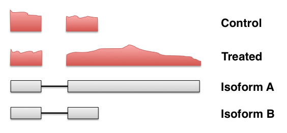
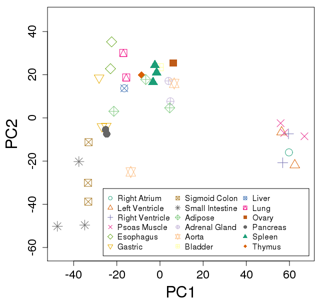
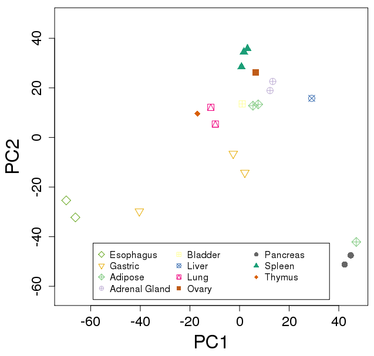

## Bioconductor Workflows Following Fast, Lightweight RNA-seq Quantifiers

[Michael Love](http://mikelove.github.io) <br>
[@mikelove](http://twitter.com/mikelove) <br>
[Bioc2016](http://bioconductor.org/help/course-materials/2016/BioC2016/) <br>
June 25, 2016 <br>
this talk: http://mikelove.github.io/bioc2016

---

## A typical gene-level RNA-seq pipeline

* Align reads (15-30 min, 2-5 Gb file)
* Count reads in genes (15-30 min)
* Stats packages for inference:
    * DESeq2, edgeR, limma-voom, etc.
* *Counts* of reads: precision of log2FC


---

## Criticisms of the standard count-based pipeline

* Counts are correlated with feature length
[Trapnell et al 2013](http://www.ncbi.nlm.nih.gov/pmc/articles/PMC3869392/)



---

## Criticisms of the standard count-based pipeline II

* Discards reads that cannot be uniquely assigned to genes [Robert & Watson 2015](https://genomebiology.biomedcentral.com/articles/10.1186/s13059-015-0734-x)


---

## Criticisms of the standard count-based pipeline III

* Slow, generates large intermediate file with exact alignments

---

## New, fast transcript quantifiers

* [Sailfish](http://www.cs.cmu.edu/~ckingsf/software/sailfish/), [Salmon](https://combine-lab.github.io/salmon/), [kallisto](https://pachterlab.github.io/kallisto/about)
* Not exact base-by-base alignments
* Rough location of read within a set of txs
* Few min / file, small memory req'd
* Output relative abundance per tx

  

<small>Diagrams from:
[Sailfish](http://www.nature.com/nbt/journal/v32/n5/full/nbt.2862.html),
[kallisto](http://www.nature.com/nbt/journal/v34/n5/full/nbt.3519.html),
[RapMap](http://bioinformatics.oxfordjournals.org/content/32/12/i192.full)
pubs </small>

---

## Using with gene DE

<http://bioconductor.org/packages/tximport>

* Sum transcript-level estimated counts to gene-level
* Collapses isoform uncertainty
* Preserves multimapping reads, increases sensitivity


---

## Using with gene DE

* Calculate an offset that accounts for changes in average transcript
  length across samples

<br>

$$ \textrm{ATL}_{gs} \equiv \sum_{i \in g} \theta_{is} \bar{l}_{is}, \quad \sum_{i \in g} \theta_{is} = 1 $$

sample .............................. $s$ <br>
gene ................................... $g$ <br>
isoform ............................. $i$ <br>
effective length ............ $\bar{l}$ <br>
percent abundance ... $\theta$

---

## Gene-level and tx-level complementary 


---

## Ex: Roadmap tissues

[Code on GitHub](https://github.com/mikelove/roadmapSalmon)

Run Salmon on 37 FASTQ: ~4 min / file

```{r eval=FALSE}
# 25 seconds to import and summarize
txi <- tximport(files, type="salmon", tx2gene=tx2gene, reader=read_tsv)
# build DESeq2 object
dds <- DESeqDataSetFromTximport(txi, samples, ~tissue)
# 4 seconds to variance stabilize
vsd <- vst(dds)
# exploratory data analysis
plotPCA(vsd, "tissue")
# differential expression
dds <- DESeq(dds)
res <- results(dds)
```

---

## Ex: Roadmap tissues

 

---

## This work in collaboration with

* Charlotte Soneson [@CSoneson](https://twitter.com/CSoneson) (UZH)
* Mark Robinson [@markrobinsonca](https://twitter.com/markrobinsonca) (UZH)

<br>

* Soneson, C., Love, M.I., Robinson, M.D. *Differential analyses for RNA-seq:
transcript-level estimates improve gene-level inferences.*
[F1000Research](http://f1000research.com/articles/4-1521/v1), Dec 2015.

<br>

## Support from

* Rafael Irizarry [@rafalab](https://twitter.com/rafalab) (DFCI & HSPH)
* NIH Cancer Training Grant

